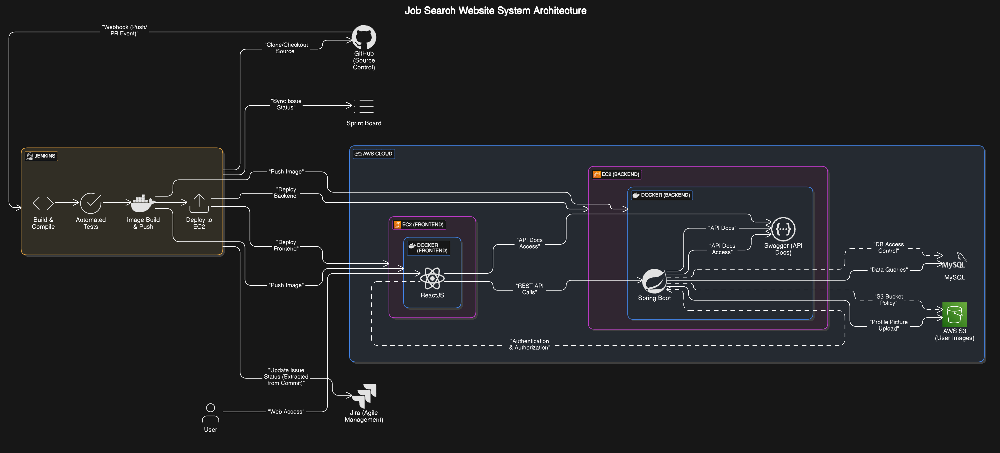

**Architecture system**

# System Overview

-   Purpose: Job search platform allowing users (employers/recruiters) to search, post, and apply for jobs.
-   Main Functions: Job posting, job searching, application submissions, user authentication, file uploads for images/resumes.

# Component Diagram

-   Frontend (ReactJS): User interface for all interactions.
-   Backend (Spring Boot): Handles business logic, API endpoints, authentication, file processing.
-   Database (MySQL): Stores user data, job posts, applications.
-   File Storage (AWS S3): Stores user-uploaded images and files.
-   Deployment (Docker on AWS EC2): Containerized services running on a single EC2 instance.
-   CI/CD Pipeline (Jenkins): Automates build, test, and deployment processes.
-   Source Control (GitHub): Manages codebase and integrates with Jenkins.
-   Monitoring (Prometheus/Grafana): Collects and visualizes system metrics.

# Technology Stack

-   ReactJS: Modern, scalable frontend framework.
-   Spring Boot (Java): Robust backend framework for RESTful APIs.
-   MySQL: Reliable relational database for structured data.
-   AWS S3: Scalable, secure file storage.
-   Docker: Containerization for consistent deployments.
-   AWS EC2: Flexible cloud infrastructure.
-   Jenkins: Automated CI/CD for frequent deployments.
-   GitHub: Source code management and collaboration.
-   Swagger: Interactive API documentation.
-   Jira: Project management and issue tracking.

# Data Flow

-   User interacts with React frontend.
-   Frontend communicates with Spring Boot backend via REST APIs.
-   Backend processes requests, interacts with MySQL for data, and AWS S3 for file storage.
-   Responses sent back to frontend for user display.

# Deployment Architecture

-   Docker containers for frontend and backend services.
-   Containers deployed to a single AWS EC2 instance.
-   MySQL and Prometheus also containerized.
-   AWS S3 used for persistent file storage outside containers.

# CI/CD Workflow

-   Developers push code to GitHub.
-   Jenkins listens for changes, pulls code, builds Docker images, runs tests, and deploys containers to EC2.
-   Deployment is triggered on every commit (continuous deployment).
-   Jenkins updates Jira tickets based on build and deployment status.

# API Documentation

-   Swagger integrated with backend for automatic API documentation.
-   Documentation accessible via dedicated endpoint on the backend service.

# Security Considerations

-   HTTPS enforced for all communications.
-   JWT-based authentication for user sessions.
-   Credentials and secrets managed securely (e.g., environment variables).
-   Permissions enforced for user roles.

# Environment Variables

Required environment variables for the application:

-   `GEMINI_API_KEY`: Google Gemini API key for chatbot functionality (required for AI chat feature)
-   `STRIPE_SECRET_KEY`: Stripe secret key for payment processing
-   `STRIPE_PUBLISHABLE_KEY`: Stripe publishable key
-   `STRIPE_WEBHOOK_SECRET`: Stripe webhook secret
-   `GMAIL_USERNAME`: Gmail username for email service
-   `GMAIL_PASSWORD`: Gmail password for email service

Set these variables in your environment or `.env` file before running the application.

# Scalability

-   Docker containers enable horizontal scaling if needed.
-   AWS S3 provides scalable file storage.
-   Architecture supports scaling out with more EC2 instances in the future.

# Monitoring & Logging

-   Prometheus collects metrics from services.
-   Grafana dashboards provide real-time system monitoring.
-   Centralized logging configured for troubleshooting and audits.
